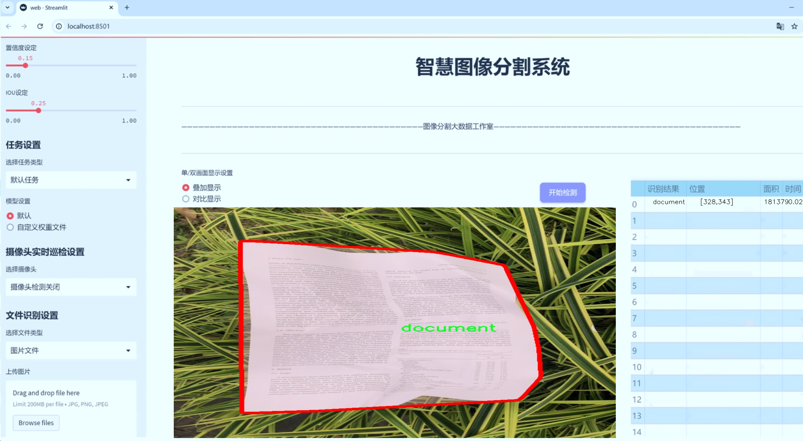
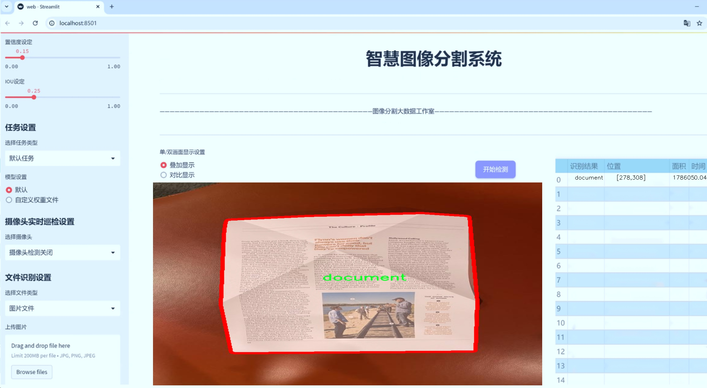
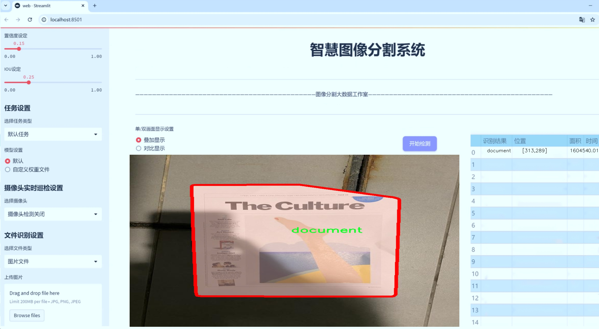
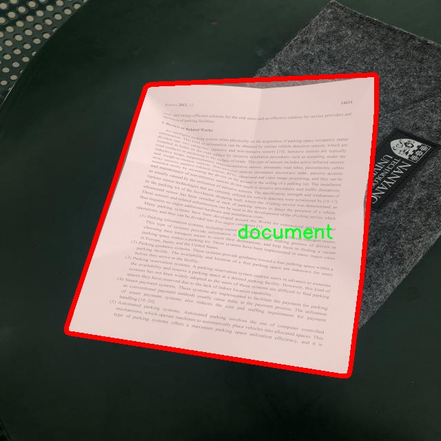
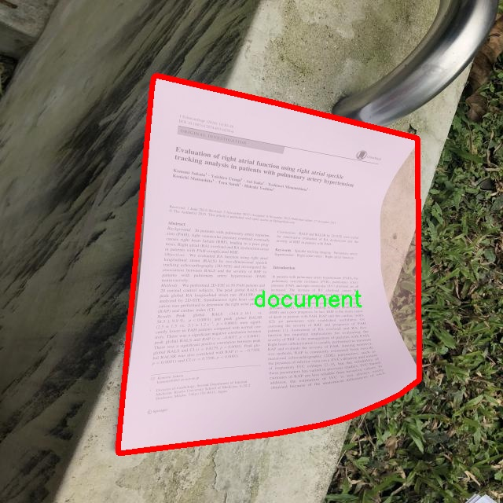
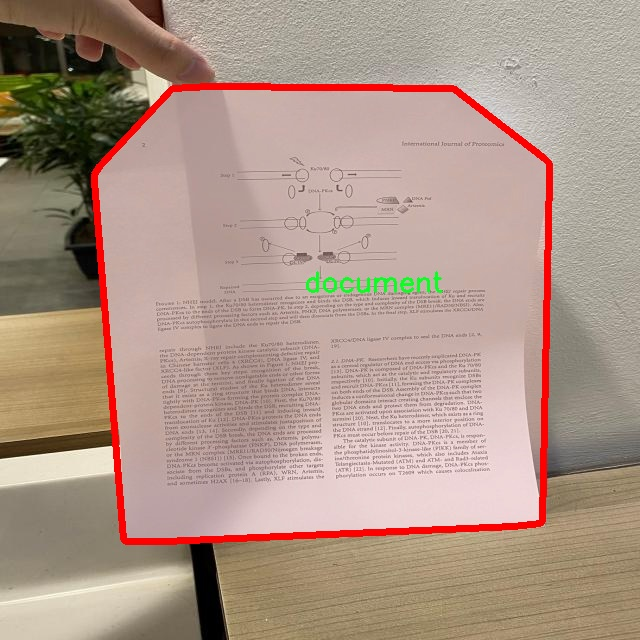
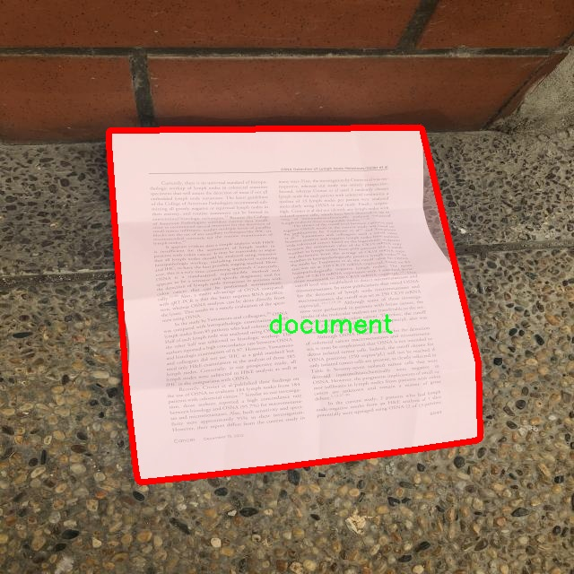

# 文档区域图像分割系统源码＆数据集分享
 [yolov8-seg-rtdetr＆yolov8-seg-SPPF-LSKA等50+全套改进创新点发刊_一键训练教程_Web前端展示]

### 1.研究背景与意义

项目参考[ILSVRC ImageNet Large Scale Visual Recognition Challenge](https://gitee.com/YOLOv8_YOLOv11_Segmentation_Studio/projects)

项目来源[AAAI Global Al lnnovation Contest](https://kdocs.cn/l/cszuIiCKVNis)

研究背景与意义

随着信息技术的迅猛发展，文档数字化和自动化处理的需求日益增加。尤其是在大数据时代，如何高效、准确地从海量文档中提取信息，成为了信息管理和知识获取领域的重要课题。传统的文档处理方法往往依赖人工审核和处理，效率低下且容易出现错误。因此，开发自动化的文档区域图像分割系统，能够显著提高文档处理的效率和准确性，具有重要的现实意义。

近年来，深度学习技术的快速发展为图像处理领域带来了革命性的变化。YOLO（You Only Look Once）系列模型作为一种高效的目标检测算法，因其实时性和高准确率而广泛应用于各类视觉任务。YOLOv8作为该系列的最新版本，结合了多种先进的深度学习技术，进一步提升了模型的性能。然而，针对特定应用场景，如文档区域的图像分割，YOLOv8仍存在一定的局限性。为此，基于改进YOLOv8的文档区域图像分割系统的研究，旨在克服现有技术的不足，提供更为精准和高效的解决方案。

本研究所使用的数据集包含4100张图像，专注于文档这一单一类别的实例分割任务。通过对这一数据集的深入分析与处理，能够为模型的训练提供丰富的样本支持。文档图像的多样性和复杂性，使得该任务充满挑战，但同时也为研究提供了良好的实验基础。文档区域的精确分割不仅有助于后续的信息提取和分析，还能为文档的自动化处理奠定基础，推动文档智能化管理的发展。

在此背景下，基于改进YOLOv8的文档区域图像分割系统的研究，具有重要的理论和实践意义。首先，从理论层面来看，研究将为深度学习在图像分割领域的应用提供新的思路和方法，推动相关技术的发展。通过对YOLOv8模型的改进，探索其在文档区域分割中的适用性，能够为后续的研究提供参考和借鉴。

其次，从实践层面来看，该系统的开发将为企业和机构在文档管理、信息提取等方面提供有效的技术支持。随着文档数量的不断增加，传统的人工处理方式已经无法满足现代社会的需求。基于改进YOLOv8的文档区域图像分割系统，能够实现文档的快速识别与处理，提升工作效率，降低人力成本，进而推动各行业的数字化转型。

综上所述，基于改进YOLOv8的文档区域图像分割系统的研究，不仅具有重要的学术价值，还能为实际应用提供切实可行的解决方案。通过这一研究，期望能够为文档处理领域带来新的突破，推动相关技术的进步与应用，最终实现文档智能化管理的目标。

### 2.图片演示







##### 注意：由于此博客编辑较早，上面“2.图片演示”和“3.视频演示”展示的系统图片或者视频可能为老版本，新版本在老版本的基础上升级如下：（实际效果以升级的新版本为准）

  （1）适配了YOLOV8的“目标检测”模型和“实例分割”模型，通过加载相应的权重（.pt）文件即可自适应加载模型。

  （2）支持“图片识别”、“视频识别”、“摄像头实时识别”三种识别模式。

  （3）支持“图片识别”、“视频识别”、“摄像头实时识别”三种识别结果保存导出，解决手动导出（容易卡顿出现爆内存）存在的问题，识别完自动保存结果并导出到tempDir中。

  （4）支持Web前端系统中的标题、背景图等自定义修改，后面提供修改教程。

  另外本项目提供训练的数据集和训练教程,暂不提供权重文件（best.pt）,需要您按照教程进行训练后实现图片演示和Web前端界面演示的效果。

### 3.视频演示

[3.1 视频演示](https://www.bilibili.com/video/BV1hm2BYEEcy/)

### 4.数据集信息展示

##### 4.1 本项目数据集详细数据（类别数＆类别名）

nc: 1
names: ['document']


##### 4.2 本项目数据集信息介绍

数据集信息展示

在本研究中，我们采用了名为“last_project_1”的数据集，以训练和改进YOLOv8-seg的文档区域图像分割系统。该数据集专注于文档图像的处理，旨在提高计算机视觉模型在文档分析中的准确性和效率。数据集的设计充分考虑了文档图像的多样性和复杂性，确保了模型在实际应用中的广泛适用性。

“last_project_1”数据集包含一个类别，即“document”。这一类别的设定反映了我们对文档图像分割任务的专注，旨在通过深度学习技术，自动识别和分割文档中的关键信息区域。数据集中的图像涵盖了各种类型的文档，包括但不限于合同、报告、发票、证书等。这些文档在格式、布局和内容上具有高度的多样性，使得数据集不仅具有挑战性，同时也为模型的训练提供了丰富的样本。

为了确保数据集的质量和有效性，我们在数据收集过程中采取了严格的标准。所有图像均经过精心挑选和标注，确保每一张图像都能够准确反映文档的特征。标注过程采用了专业的图像标注工具，确保文档区域的边界清晰可见，并且标注的一致性得到了有效维护。这一过程不仅提高了数据集的可靠性，也为后续的模型训练奠定了坚实的基础。

在数据集的构建过程中，我们还特别关注了图像的多样性和代表性。为此，我们从不同来源收集了大量的文档图像，确保涵盖了各种字体、颜色、布局和语言。这种多样性使得模型在训练过程中能够学习到更丰富的特征，从而在面对不同类型的文档时，能够表现出更强的鲁棒性和适应性。

此外，数据集的规模也是我们考虑的重要因素之一。为了提高模型的泛化能力，我们确保数据集中包含足够数量的样本，以便模型能够学习到文档图像的多种特征。通过对数据集进行合理的划分，我们能够在训练、验证和测试阶段，充分利用这些样本，从而提高模型的性能。

在进行模型训练时，我们将“last_project_1”数据集与YOLOv8-seg算法相结合，利用其先进的特征提取和分割能力，旨在实现高效的文档区域分割。通过不断迭代和优化，我们期望能够显著提升模型在文档图像分割任务中的表现，使其在实际应用中能够提供更为准确和高效的解决方案。

综上所述，“last_project_1”数据集不仅为YOLOv8-seg的训练提供了丰富的样本和多样的特征，还为文档图像分割的研究提供了重要的基础。我们相信，通过对该数据集的深入研究和应用，能够推动文档图像处理技术的发展，为相关领域的应用提供更为可靠的支持。










### 5.全套项目环境部署视频教程（零基础手把手教学）

[5.1 环境部署教程链接（零基础手把手教学）](https://www.bilibili.com/video/BV1jG4Ve4E9t/?vd_source=bc9aec86d164b67a7004b996143742dc)


[5.2 安装Python虚拟环境创建和依赖库安装视频教程链接（零基础手把手教学）](https://www.bilibili.com/video/BV1nA4VeYEze/?vd_source=bc9aec86d164b67a7004b996143742dc)

### 6.手把手YOLOV8-seg训练视频教程（零基础小白有手就能学会）

[6.1 手把手YOLOV8-seg训练视频教程（零基础小白有手就能学会）](https://www.bilibili.com/video/BV1cA4VeYETe/?vd_source=bc9aec86d164b67a7004b996143742dc)


按照上面的训练视频教程链接加载项目提供的数据集，运行train.py即可开始训练



     Epoch   gpu_mem       box       obj       cls    labels  img_size
     1/200     0G   0.01576   0.01955  0.007536        22      1280: 100%|██████████| 849/849 [14:42<00:00,  1.04s/it]
               Class     Images     Labels          P          R     mAP@.5 mAP@.5:.95: 100%|██████████| 213/213 [01:14<00:00,  2.87it/s]
                 all       3395      17314      0.994      0.957      0.0957      0.0843

     Epoch   gpu_mem       box       obj       cls    labels  img_size
     2/200     0G   0.01578   0.01923  0.007006        22      1280: 100%|██████████| 849/849 [14:44<00:00,  1.04s/it]
               Class     Images     Labels          P          R     mAP@.5 mAP@.5:.95: 100%|██████████| 213/213 [01:12<00:00,  2.95it/s]
                 all       3395      17314      0.996      0.956      0.0957      0.0845

     Epoch   gpu_mem       box       obj       cls    labels  img_size
     3/200     0G   0.01561    0.0191  0.006895        27      1280: 100%|██████████| 849/849 [10:56<00:00,  1.29it/s]
               Class     Images     Labels          P          R     mAP@.5 mAP@.5:.95: 100%|███████   | 187/213 [00:52<00:00,  4.04it/s]
                 all       3395      17314      0.996      0.957      0.0957      0.0845


### 7.50+种全套YOLOV8-seg创新点代码加载调参视频教程（一键加载写好的改进模型的配置文件）

[7.1 50+种全套YOLOV8-seg创新点代码加载调参视频教程（一键加载写好的改进模型的配置文件）](https://www.bilibili.com/video/BV1Hw4VePEXv/?vd_source=bc9aec86d164b67a7004b996143742dc)

### 8.YOLOV8-seg图像分割算法原理

原始YOLOv8-seg算法原理

YOLOv8-seg算法是Ultralytics公司在2023年推出的最新版本YOLO系列算法，代表了目标检测和图像分割领域的一次重要进步。该算法在前几代YOLO模型的基础上进行了多项创新和改进，旨在提升检测精度、速度和灵活性。YOLOv8-seg不仅继承了YOLO系列一贯的高效性和实时性，还在图像分割任务中引入了更为复杂的特征提取和处理机制，使其在多种应用场景中表现出色。

首先，YOLOv8-seg的输入处理部分采用了640x640的默认图像尺寸，然而为了适应不同长宽比的输入图像，算法在推理阶段引入了自适应图像缩放技术。这一技术通过将图像的长边缩放至指定尺寸，并对短边进行填充，最大限度地减少了信息冗余，从而提高了目标检测和推理的速度。此外，在训练过程中，YOLOv8-seg使用了Mosaic数据增强技术，该技术通过随机拼接四张不同的图像，生成新的训练样本。这种增强方式不仅丰富了训练数据，还有效提高了模型对不同场景和位置的适应能力，从而提升了最终的预测精度。

在网络结构方面，YOLOv8-seg的主干网络（Backbone）采用了CSPDarknet结构，并在此基础上引入了C2F模块。C2F模块的设计灵感来源于YOLOv7中的ELAN模块，通过并行多个梯度流分支，显著提升了特征提取的能力。与YOLOv5中的C3模块相比，C2F模块能够更有效地捕捉到丰富的梯度信息，从而增强了模型的特征表示能力。此外，YOLOv8-seg还使用了快速空间金字塔池化（SPPF）结构，以提取不同尺度的特征，进一步提升了特征提取的效率和模型的性能。

在Neck部分，YOLOv8-seg采用了路径聚合网络（PAN）结构，增强了对不同尺度对象的特征融合能力。通过多层卷积和池化操作，Neck部分能够有效地处理和压缩特征图，为后续的目标检测和分割任务提供了更为精确的特征表示。该结构的设计使得YOLOv8-seg在处理复杂场景时，能够更好地捕捉到目标的多样性和复杂性。

YOLOv8-seg的Head部分是其最大的创新之一。与YOLOv5的耦合头结构不同，YOLOv8-seg采用了解耦头结构，将分类和检测任务分开处理。这一设计使得模型在进行目标检测时，能够更专注于每个任务的特定需求，进而提高了检测精度。在损失函数的设计上，YOLOv8-seg针对分类和回归任务分别采用了不同的损失计算方法。分类分支使用了二元交叉熵损失（BCELoss），而回归分支则结合了分布焦点损失（DFLoss）和完全交并比损失（CIOULoss），以确保模型能够快速聚焦于标签附近的数值，提高边界框预测的准确性。

此外，YOLOv8-seg还摒弃了传统的Anchor-Based检测方法，转而采用了Anchor-Free的关键点检测方式。这一转变不仅简化了模型结构，还提高了检测速度和准确度。Anchor-Free方法通过直接预测目标的中心点和宽高比例，避免了预设Anchor的复杂性，使得模型在处理不同尺度和形状的目标时更加灵活和高效。

在实际应用中，YOLOv8-seg表现出了极高的实时性和准确性，适用于各种目标检测和图像分割任务。无论是在自动驾驶、安防监控，还是在医学影像分析等领域，YOLOv8-seg都展现出了强大的能力。其高效的特征提取和处理机制，使得该算法能够在复杂环境中保持稳定的性能，满足实时处理的需求。

综上所述，YOLOv8-seg算法通过引入自适应图像缩放、Mosaic数据增强、C2F模块、PAN结构以及解耦头设计等多项创新，极大地提升了目标检测和图像分割的性能。其在处理复杂场景和多样化目标时的灵活性和高效性，使其成为当前目标检测领域的佼佼者。随着YOLOv8-seg的不断发展和优化，未来在更多实际应用中，其潜力将得到进一步挖掘和实现。


### 9.系统功能展示（检测对象为举例，实际内容以本项目数据集为准）

图9.1.系统支持检测结果表格显示

  图9.2.系统支持置信度和IOU阈值手动调节

  图9.3.系统支持自定义加载权重文件best.pt(需要你通过步骤5中训练获得)

  图9.4.系统支持摄像头实时识别

  图9.5.系统支持图片识别

  图9.6.系统支持视频识别

  图9.7.系统支持识别结果文件自动保存

  图9.8.系统支持Excel导出检测结果数据


### 10.50+种全套YOLOV8-seg创新点原理讲解（非科班也可以轻松写刊发刊，V11版本正在科研待更新）

#### 10.1 由于篇幅限制，每个创新点的具体原理讲解就不一一展开，具体见下列网址中的创新点对应子项目的技术原理博客网址【Blog】：


[10.1 50+种全套YOLOV8-seg创新点原理讲解链接](https://gitee.com/qunmasj/good)

#### 10.2 部分改进模块原理讲解(完整的改进原理见上图和技术博客链接)【如果此小节的图加载失败可以通过CSDN或者Github搜索该博客的标题访问原始博客，原始博客图片显示正常】
### YOLOv8简介
YOLO（You Only Look Once）是一种流行的对象检测和图像分割模型，由华盛顿大学的Joseph Redmon和Ali Farhadi开发。YOLO于2015年推出，以其高速度和高精度迅速走红。

YOLOv2于2016年发布，通过合并批处理规范化、锚盒和维度集群来改进原始模型
2018年推出的YOLOv3使用更高效的骨干网络、多个锚点和空间金字塔池进一步增强了该模型的性能
YOLOv4于2020年发布，引入了Mosaic数据增强、新的无锚检测头和新的丢失功能等创新
YOLOv5进一步提高了模型的性能，并添加了超参数优化、集成实验跟踪和自动导出到流行导出格式等新功能
YOLOv6于2022年由美团开源，目前正在该公司的许多自动配送机器人中使用
YOLOv7在COCO关键点数据集上添加了额外的任务，如姿态估计
YOLOv8是Ultralytics公司推出的YOLO的最新版本。作为一款尖端、最先进的（SOTA）车型，YOLOv8在之前版本的成功基础上，引入了新的功能和改进，以增强性能、灵活性和效率。YOLOv8支持全方位的视觉AI任务，包括检测、分割、姿态估计、跟踪和分类。这种多功能性允许用户在不同的应用程序和域中利用YOLOv8的功能
#### YOLOv8的新特性与可用模型

Ultralytics 并没有直接将开源库命名为 YOLOv8，而是直接使用 ultralytics 这个词，原因是 ultralytics 将这个库定位为算法框架，而非某一个特定算法，一个主要特点是可扩展性。其希望这个库不仅仅能够用于 YOLO 系列模型，而是能够支持非 YOLO 模型以及分类分割姿态估计等各类任务。总而言之，ultralytics 开源库的两个主要优点是：

融合众多当前 SOTA 技术于一体
未来将支持其他 YOLO 系列以及 YOLO 之外的更多算法
Ultralytics为YOLO模型发布了一个全新的存储库。它被构建为 用于训练对象检测、实例分割和图像分类模型的统一框架。

提供了一个全新的 SOTA 模型，包括 P5 640 和 P6 1280 分辨率的目标检测网络和基于 YOLACT 的实例分割模型。和 YOLOv5 一样，基于缩放系数也提供了 N/S/M/L/X 尺度的不同大小模型，用于满足不同场景需求
骨干网络和 Neck 部分可能参考了 YOLOv7 ELAN 设计思想，将 YOLOv5 的 C3 结构换成了梯度流更丰富的 C2f 结构，并对不同尺度模型调整了不同的通道数，属于对模型结构精心微调，不再是无脑一套参数应用所有模型，大幅提升了模型性能。不过这个 C2f 模块中存在 Split 等操作对特定硬件部署没有之前那么友好了
Head 部分相比 YOLOv5 改动较大，换成了目前主流的解耦头结构，将分类和检测头分离，同时也从 Anchor-Based 换成了 Anchor-Free
Loss 计算方面采用了 TaskAlignedAssigner 正样本分配策略，并引入了 Distribution Focal Loss
训练的数据增强部分引入了 YOLOX 中的最后 10 epoch 关闭 Mosiac 增强的操作，可以有效地提升精度
YOLOv8 还高效灵活地支持多种导出格式，并且该模型可以在 CPU 和 GPU 上运行。YOLOv8 模型的每个类别中有五个模型用于检测、分割和分类。YOLOv8 Nano 是最快和最小的，而 YOLOv8 Extra Large (YOLOv8x) 是其中最准确但最慢的。


### FocalModulation模型的基本原理
参考该博客，Focal Modulation Networks（FocalNets）的基本原理是替换自注意力（Self-Attention）模块，使用焦点调制（focal modulation）机制来捕捉图像中的长距离依赖和上下文信息。下图是自注意力和焦点调制两种方法的对比。


自注意力要求对每个查询令牌（Query Token）与其他令牌进行复杂的查询-键（Query-Key）交互和查询-值（Query-Value）聚合，以计算注意力分数并捕捉上下文。而焦点调制则先将空间上下文以不同粒度聚合到调制器中，然后以查询依赖的方式将这些调制器注入到查询令牌中。焦点调制简化了交互和聚合操作，使其更轻量级。在图中，自注意力部分使用红色虚线表示查询-键交互和黄色虚线表示查询-值聚合，而焦点调制部分则用蓝色表示调制器聚合和黄色表示查询-调制器交互。 

FocalModulation模型通过以下步骤实现：

1. 焦点上下文化：用深度卷积层堆叠来编码不同范围的视觉上下文。


2. 门控聚合：通过门控机制，选择性地将上下文信息聚合到每个查询令牌的调制器中。


3. 逐元素仿射变换：将聚合后的调制器通过仿射变换注入到每个查询令牌中。

下面来分别介绍这三个机制->

#### 焦点上下文化
焦点上下文化（Focal Contextualization）是焦点调制（Focal Modulation）的一个组成部分。焦点上下文化使用一系列深度卷积层（depth-wise convolutional layers）来编码不同范围内的视觉上下文信息。这些层可以捕捉从近处到远处的视觉特征，从而允许网络在不同层次上理解图像内容。通过这种方式，网络能够在聚合上下文信息时保持对局部细节的敏感性，并增强对全局结构的认识。


​

这张图详细比较了自注意力（Self-Attention, SA）和焦点调制（Focal Modulation）的机制，并特别展示了焦点调制中的上下文聚合过程。左侧的图展示了自注意力模型如何通过键（k）和查询（q）之间的交互，以及随后的聚合来生成输出。而中间和右侧的图说明了焦点调制如何通过层级化的上下文聚合和门控聚合过程替代自注意力模型的这一过程。在焦点调制中，输入首先通过轻量级线性层进行处理，然后通过层级化的上下文化模块和门控机制来选择性地聚合信息，最终通过调制器与查询（q）进行交互以生成输出。

#### 门控聚合
在Focal Modulation Networks（FocalNets）中的 "门控聚合"（Gated Aggregation）是关键组件之一，这一过程涉及使用门控机制来选择性地聚合上下文信息。以下是这个过程的详细分析：

1. 什么是门控机制？
门控机制在深度学习中常用于控制信息流。它通常用于决定哪些信息应该被传递，哪些应该被阻断。在循环神经网络（RNN）中，特别是在长短期记忆网络（LSTM）和门控循环单元（GRU）中，门控机制用于调节信息在时间序列数据中的流动。

2. 门控聚合的目的
在FocalNets中，门控聚合的目的是为每个查询令牌（即处理中的数据单元）选择性地聚合上下文信息。这意味着网络能够决定哪些特定的上下文信息对于当前处理的查询令牌是重要的，从而专注于那些最相关的信息。

3. 如何实现门控聚合？
实现门控聚合可能涉及一系列计算步骤，其中包括：

计算上下文信息：这可能涉及使用深度卷积层（如文中提到的）对输入图像的不同区域进行编码，以捕捉从局部到全局的视觉上下文。
门控操作：这一步骤涉及到一个决策过程，根据当前查询令牌的特征来决定哪些上下文信息是相关的。这可能通过一个学习到的权重（门）来实现，该权重决定了不同上下文信息的重要性。
信息聚合：最后，根据门控操作的结果，选择性地聚合上下文信息到一个调制器中。这个调制器随后被用于调整或“调制”查询令牌的表示。
4. 门控聚合的好处
通过门控聚合，FocalNets能够更有效地聚焦于对当前任务最关键的信息。这种方法提高了模型的效率和性能，因为它减少了不必要信息的处理，同时增强了对关键特征的关注。在视觉任务中，这可能意味着更好的目标检测和图像分类性能，特别是在复杂或多变的视觉环境中。

总结：门控聚合是FocalNets的一个核心组成部分，它通过选择性地集中处理重要的上下文信息来提升网络的效率和性能。

#### 逐元素仿射变换
在Focal Modulation Networks（FocalNets）中的第三个关键组件是逐元素仿射变换，这个步骤涉及将通过门控聚合得到的调制器注入到每个查询令牌中。以下是该过程的详细分析：

1. 仿射变换的基本概念：
仿射变换是一种线性变换，用于对数据进行缩放、旋转、平移和倾斜等操作。在深度学习中，逐元素的仿射变换通常指的是对每个元素进行线性变换，这种变换可以被描述为y = ax + b，其中x是输入，y是输出，a和b是变换的参数。

2. 逐元素仿射变换的作用：
在FocalNets中，逐元素仿射变换的作用是将聚合后的调制器信息注入到每个查询令牌中。这个步骤对于整合上下文信息和查询令牌的原始特征非常重要。通过这种方式，调制器所包含的上下文信息可以直接影响查询令牌的表示。

3. 执行仿射变换：
执行这一步骤时，聚合后的调制器对每个查询令牌进行逐元素的仿射变换。在实践中，这可能意味着对查询令牌的每个特征应用调制器中的相应权重（a）和偏差（b）。这样，调制器中的每个元素都直接对应于查询令牌的一个特征，通过调整这些特征来改变其表达。

4. 仿射变换的效果：
通过逐元素仿射变换，模型能够更细致地调整每个查询令牌的特征，根据上下文信息来增强或抑制某些特征。这种精细的调整机制允许网络更好地适应复杂的视觉场景，提高对细节的捕捉能力，从而提升了模型在各种视觉任务中的性能，如目标检测和图像分类。

总结：逐元素仿射变换它使得模型能够利用上下文信息来有效地调整查询令牌，增强了模型对关键视觉特征的捕捉和表达能力。


### 11.项目核心源码讲解（再也不用担心看不懂代码逻辑）

#### 11.1 ultralytics\nn\extra_modules\kernel_warehouse.py

以下是经过简化和注释的核心代码部分，主要保留了`Attention`、`KWconvNd`、`Warehouse_Manager`和`KWConv`类的核心实现，以及相关的初始化和前向传播逻辑。

```python
import torch
import torch.nn as nn
import torch.nn.functional as F
import collections.abc
from itertools import repeat

def parse(x, n):
    """解析输入参数x，确保其长度为1或n，返回一个长度为n的列表。"""
    if isinstance(x, collections.abc.Iterable):
        if len(x) == 1:
            return list(repeat(x[0], n))
        elif len(x) == n:
            return x
        else:
            raise ValueError('length of x should be 1 or n')
    else:
        return list(repeat(x, n))

class Attention(nn.Module):
    """注意力机制模块，用于动态调整卷积核的权重。"""
    def __init__(self, in_planes, reduction, num_static_cell, num_local_mixture, norm_layer=nn.BatchNorm1d):
        super(Attention, self).__init__()
        hidden_planes = max(int(in_planes * reduction), 16)  # 隐藏层通道数
        self.kw_planes_per_mixture = num_static_cell + 1  # 每个混合的通道数
        self.num_local_mixture = num_local_mixture  # 本地混合数
        self.kw_planes = self.kw_planes_per_mixture * num_local_mixture  # 总通道数

        # 定义网络层
        self.avgpool = nn.AdaptiveAvgPool1d(1)  # 自适应平均池化
        self.fc1 = nn.Linear(in_planes, hidden_planes)  # 全连接层1
        self.norm1 = norm_layer(hidden_planes)  # 归一化层
        self.act1 = nn.ReLU(inplace=True)  # 激活函数

        # 全连接层2
        self.fc2 = nn.Linear(hidden_planes, self.kw_planes)  
        self.temp_bias = torch.zeros([self.kw_planes], requires_grad=False)  # 温度偏置
        self.temp_value = 0  # 温度值
        self._initialize_weights()  # 初始化权重

    def _initialize_weights(self):
        """初始化网络权重。"""
        for m in self.modules():
            if isinstance(m, nn.Linear):
                nn.init.kaiming_normal_(m.weight, mode='fan_out', nonlinearity='relu')
                if m.bias is not None:
                    nn.init.constant_(m.bias, 0)
            if isinstance(m, nn.BatchNorm1d):
                nn.init.constant_(m.weight, 1)
                nn.init.constant_(m.bias, 0)

    def forward(self, x):
        """前向传播，计算注意力权重。"""
        x = self.avgpool(x.reshape(*x.shape[:2], -1)).squeeze(dim=-1)  # 池化
        x = self.act1(self.norm1(self.fc1(x)))  # 激活
        x = self.fc2(x)  # 计算注意力权重
        x = x / (torch.sum(torch.abs(x), dim=1).view(-1, 1) + 1e-3)  # 归一化
        x = (1.0 - self.temp_value) * x + self.temp_value * self.temp_bias.to(x.device).view(1, -1)  # 温度调整
        return x

class KWconvNd(nn.Module):
    """动态卷积层基类。"""
    def __init__(self, in_planes, out_planes, kernel_size, stride=1, padding=0, dilation=1, groups=1, bias=False):
        super(KWconvNd, self).__init__()
        self.in_planes = in_planes
        self.out_planes = out_planes
        self.kernel_size = parse(kernel_size, 2)  # 解析卷积核大小
        self.stride = parse(stride, 2)  # 解析步幅
        self.padding = parse(padding, 2)  # 解析填充
        self.dilation = parse(dilation, 2)  # 解析膨胀
        self.groups = groups  # 分组卷积
        self.bias = nn.Parameter(torch.zeros([self.out_planes]), requires_grad=True) if bias else None  # 偏置

    def forward(self, x):
        """前向传播，执行卷积操作。"""
        # 这里省略了具体的卷积操作实现
        return x  # 返回卷积结果

class Warehouse_Manager(nn.Module):
    """卷积核仓库管理器，用于管理卷积核的动态分配。"""
    def __init__(self, reduction=0.0625):
        super(Warehouse_Manager, self).__init__()
        self.reduction = reduction  # 隐藏层的缩减比例
        self.warehouse_list = {}  # 存储卷积核信息

    def reserve(self, in_planes, out_planes, kernel_size=1, stride=1, padding=0, groups=1, bias=True, warehouse_name='default'):
        """预留卷积层的信息。"""
        weight_shape = [out_planes, in_planes, *parse(kernel_size, 2)]  # 卷积核形状
        if warehouse_name not in self.warehouse_list:
            self.warehouse_list[warehouse_name] = []
        self.warehouse_list[warehouse_name].append(weight_shape)  # 记录卷积核形状
        return KWconvNd(in_planes, out_planes, kernel_size, stride, padding, groups, bias)  # 返回动态卷积层

class KWConv(nn.Module):
    """动态卷积层的封装，包含批归一化和激活函数。"""
    def __init__(self, c1, c2, wm=None, wm_name=None, k=1, s=1, p=None, g=1, d=1, act=True):
        super().__init__()
        assert wm is not None, 'wm param must be class Warehouse_Manager.'
        assert wm_name is not None, 'wm_name param must not be None.'
        
        self.conv = wm.reserve(c1, c2, k, s, p, d, g, False, wm_name)  # 预留卷积层
        self.bn = nn.BatchNorm2d(c2)  # 批归一化
        self.act = nn.ReLU() if act else nn.Identity()  # 激活函数

    def forward(self, x):
        """前向传播，执行卷积、归一化和激活。"""
        x = self.conv(x)  # 卷积
        x = self.bn(x)  # 归一化
        x = self.act(x)  # 激活
        return x
```

### 代码说明
1. **Attention类**：实现了一个注意力机制，通过自适应平均池化和全连接层来计算注意力权重，并通过温度参数进行调整。
2. **KWconvNd类**：动态卷积层的基类，负责卷积操作的基本参数设置。
3. **Warehouse_Manager类**：管理卷积核的仓库，负责卷积层的动态分配和卷积核信息的存储。
4. **KWConv类**：封装了动态卷积层，添加了批归一化和激活函数的功能。

这些核心部分构成了一个灵活的动态卷积网络架构，能够根据输入的特征动态调整卷积核的权重。

这个文件主要实现了一个名为“Kernel Warehouse”的模块，旨在通过动态管理卷积核来提高神经网络的效率和灵活性。文件中包含多个类和函数，下面对其进行逐一说明。

首先，文件导入了必要的库，包括PyTorch的核心模块和一些数学工具。接着，定义了一个`parse`函数，用于解析输入参数，以确保它们的格式符合预期。

接下来是`Attention`类，这是一个自定义的神经网络模块，负责计算注意力权重。它的构造函数接收多个参数，包括输入通道数、缩减比例、静态单元数量等。该类内部包含多个线性层和激活函数，并通过`forward`方法计算输入的注意力权重。在`forward`方法中，输入首先经过平均池化、线性变换和归一化，然后通过注意力机制生成输出。

`KWconvNd`类是一个基于`nn.Module`的卷积层，支持多维卷积（1D、2D、3D）。它的构造函数接收输入和输出通道数、卷积核大小、步幅、填充等参数，并通过`init_attention`方法初始化注意力机制。`forward`方法中，首先计算注意力权重，然后从仓库中获取卷积核，并执行卷积操作。

随后，定义了三个具体的卷积类：`KWConv1d`、`KWConv2d`和`KWConv3d`，分别用于处理1D、2D和3D卷积。这些类继承自`KWconvNd`，并指定了相应的维度和卷积函数。

`KWLinear`类是一个线性层的实现，内部使用了`KWConv1d`来实现线性变换。

`Warehouse_Manager`类是核心管理类，负责管理卷积核的仓库。它的构造函数接收多个参数，用于配置仓库的行为。该类提供了`reserve`方法，用于创建动态卷积层而不分配卷积权重，并记录其信息。`store`方法用于计算并存储卷积核的形状和数量。`allocate`方法则用于分配卷积核，并初始化权重。

最后，`KWConv`类是一个封装类，用于结合卷积、批归一化和激活函数，简化模型的构建。

此外，文件还定义了一个`get_temperature`函数，用于计算温度值，以便在训练过程中动态调整。

总体而言，这个文件实现了一个灵活的卷积核管理系统，通过注意力机制和动态权重分配，旨在提高深度学习模型的性能和适应性。

#### 11.2 ui.py

以下是代码中最核心的部分，并附上详细的中文注释：

```python
import sys
import subprocess

def run_script(script_path):
    """
    使用当前 Python 环境运行指定的脚本。

    Args:
        script_path (str): 要运行的脚本路径

    Returns:
        None
    """
    # 获取当前 Python 解释器的路径
    python_path = sys.executable

    # 构建运行命令，使用 streamlit 运行指定的脚本
    command = f'"{python_path}" -m streamlit run "{script_path}"'

    # 执行命令
    result = subprocess.run(command, shell=True)
    # 检查命令执行的返回码，如果不为0则表示出错
    if result.returncode != 0:
        print("脚本运行出错。")

# 实例化并运行应用
if __name__ == "__main__":
    # 指定要运行的脚本路径
    script_path = "web.py"  # 这里可以直接指定脚本名，假设在当前目录下

    # 调用函数运行脚本
    run_script(script_path)
```

### 代码注释说明：
1. **导入模块**：
   - `sys`：用于访问与 Python 解释器紧密相关的变量和函数。
   - `subprocess`：用于创建新进程、连接到它们的输入/输出/错误管道，并获得它们的返回码。

2. **`run_script` 函数**：
   - 该函数接受一个脚本路径作为参数，并使用当前 Python 环境运行该脚本。
   - 使用 `sys.executable` 获取当前 Python 解释器的路径，以确保使用正确的 Python 环境。
   - 构建一个命令字符串，使用 `streamlit` 模块运行指定的脚本。
   - 使用 `subprocess.run` 执行构建的命令，并检查返回码以判断脚本是否成功运行。

3. **主程序块**：
   - 在 `if __name__ == "__main__":` 中，确保只有在直接运行该脚本时才会执行以下代码。
   - 指定要运行的脚本路径（这里假设脚本在当前目录下）。
   - 调用 `run_script` 函数来执行指定的脚本。

这个程序文件的主要功能是使用当前的 Python 环境来运行一个指定的脚本，具体是一个名为 `web.py` 的文件。程序首先导入了必要的模块，包括 `sys`、`os` 和 `subprocess`，以及一个自定义的 `abs_path` 函数，用于获取文件的绝对路径。

在 `run_script` 函数中，首先获取当前 Python 解释器的路径，这样可以确保使用正确的 Python 环境来执行脚本。接着，构建一个命令字符串，这个命令会调用 `streamlit` 模块来运行指定的脚本。`streamlit` 是一个用于构建数据应用的库，因此这里的 `web.py` 脚本很可能是一个使用 `streamlit` 创建的 web 应用。

然后，使用 `subprocess.run` 方法来执行这个命令。`shell=True` 参数允许在 shell 中执行命令，这样可以直接使用字符串形式的命令。执行后，程序会检查返回的状态码，如果返回码不为 0，表示脚本运行过程中出现了错误，程序会打印出相应的错误信息。

在文件的最后部分，使用 `if __name__ == "__main__":` 语句来确保只有在直接运行这个文件时才会执行下面的代码。这里指定了要运行的脚本路径，即 `web.py`，并调用 `run_script` 函数来启动这个脚本。

总体来说，这个程序是一个简单的脚本启动器，旨在便捷地运行一个基于 `streamlit` 的 web 应用。

#### 11.3 ultralytics\models\rtdetr\predict.py

以下是代码中最核心的部分，并附上详细的中文注释：

```python
import torch
from ultralytics.data.augment import LetterBox
from ultralytics.engine.predictor import BasePredictor
from ultralytics.engine.results import Results
from ultralytics.utils import ops

class RTDETRPredictor(BasePredictor):
    """
    RT-DETR（实时检测变换器）预测器，扩展自BasePredictor类，用于使用百度的RT-DETR模型进行预测。

    该类利用视觉变换器的强大功能，提供实时物体检测，同时保持高精度。它支持高效的混合编码和IoU感知查询选择等关键特性。
    """

    def postprocess(self, preds, img, orig_imgs):
        """
        对模型的原始预测结果进行后处理，以生成边界框和置信度分数。

        该方法根据置信度和类别（如果在`self.args`中指定）过滤检测结果。

        参数:
            preds (torch.Tensor): 模型的原始预测结果。
            img (torch.Tensor): 处理后的输入图像。
            orig_imgs (list或torch.Tensor): 原始未处理的图像。

        返回:
            (list[Results]): 包含后处理边界框、置信度分数和类别标签的Results对象列表。
        """
        # 获取预测结果的维度
        nd = preds[0].shape[-1]
        # 将预测结果分割为边界框和分数
        bboxes, scores = preds[0].split((4, nd - 4), dim=-1)

        # 如果原始图像不是列表，则将其转换为numpy数组
        if not isinstance(orig_imgs, list):
            orig_imgs = ops.convert_torch2numpy_batch(orig_imgs)

        results = []
        for i, bbox in enumerate(bboxes):  # 遍历每个边界框
            bbox = ops.xywh2xyxy(bbox)  # 将边界框格式从xywh转换为xyxy
            score, cls = scores[i].max(-1, keepdim=True)  # 获取最大分数和对应的类别
            idx = score.squeeze(-1) > self.args.conf  # 根据置信度阈值过滤
            if self.args.classes is not None:
                # 如果指定了类别，则进一步过滤
                idx = (cls == torch.tensor(self.args.classes, device=cls.device)).any(1) & idx
            
            # 过滤后的预测结果
            pred = torch.cat([bbox, score, cls], dim=-1)[idx]
            orig_img = orig_imgs[i]  # 获取原始图像
            oh, ow = orig_img.shape[:2]  # 获取原始图像的高度和宽度
            # 将边界框坐标缩放到原始图像的尺寸
            pred[..., [0, 2]] *= ow
            pred[..., [1, 3]] *= oh
            img_path = self.batch[0][i]  # 获取图像路径
            # 将结果添加到结果列表中
            results.append(Results(orig_img, path=img_path, names=self.model.names, boxes=pred))
        return results

    def pre_transform(self, im):
        """
        在将输入图像送入模型进行推理之前，对其进行预处理。输入图像被调整为方形的长宽比并填充。

        参数:
            im (list[np.ndarray] | torch.Tensor): 输入图像，形状为(N,3,h,w)的张量，或[(h,w,3) x N]的列表。

        返回:
            (list): 预处理后的图像列表，准备进行模型推理。
        """
        letterbox = LetterBox(self.imgsz, auto=False, scaleFill=True)  # 创建LetterBox对象
        return [letterbox(image=x) for x in im]  # 对每个图像进行LetterBox处理
```

### 代码核心部分说明：
1. **postprocess 方法**：该方法负责将模型的原始预测结果转换为可用的边界框和置信度分数，并进行过滤。它处理每个预测的边界框，计算其置信度，并根据给定的阈值和类别进行筛选，最终返回一个包含结果的列表。

2. **pre_transform 方法**：该方法用于在推理之前对输入图像进行预处理，以确保图像的长宽比为方形并进行适当的缩放。这是为了满足模型输入的要求。

这些部分是RT-DETR预测器的核心功能，负责处理输入和输出，确保模型能够有效地进行推理和结果展示。

这个程序文件是一个用于实时目标检测的预测器，名为`RTDETRPredictor`，它继承自`BasePredictor`类，专门用于使用百度的RT-DETR模型进行预测。RT-DETR模型结合了视觉变换器的优势，能够在保持高精度的同时实现实时目标检测。该类支持高效的混合编码和IoU（Intersection over Union）感知的查询选择等关键特性。

在使用该预测器时，用户可以通过传入模型路径和数据源等参数来初始化一个`RTDETRPredictor`对象，然后调用`predict_cli`方法进行预测。该类的主要属性包括`imgsz`，表示推理时的图像大小（必须是正方形并且填充比例合适），以及`args`，用于存储传递给预测器的参数。

该类的`postprocess`方法用于对模型的原始预测结果进行后处理，以生成边界框和置信度分数。该方法会根据置信度和指定的类别过滤检测结果。具体来说，它首先将预测结果分割为边界框和分数，然后对每个边界框进行坐标转换，并根据置信度和类别进行筛选。最后，生成的结果将包括原始图像、图像路径、类别名称和过滤后的边界框信息。

`pre_transform`方法则用于在将输入图像送入模型进行推理之前进行预处理。它使用`LetterBox`类将输入图像调整为正方形，并确保填充比例合适。该方法支持两种输入格式：一种是形状为(N, 3, h, w)的张量，另一种是包含多个图像的列表。

总的来说，这个文件提供了一个高效的框架，用于利用RT-DETR模型进行实时目标检测，并且具备了必要的图像预处理和后处理功能。

#### 11.4 ultralytics\models\fastsam\utils.py

以下是代码中最核心的部分，并附上详细的中文注释：

```python
import torch

def adjust_bboxes_to_image_border(boxes, image_shape, threshold=20):
    """
    调整边界框，使其在一定阈值内贴合图像边界。

    参数:
        boxes (torch.Tensor): 边界框的坐标，形状为 (n, 4)
        image_shape (tuple): 图像的高度和宽度，形状为 (height, width)
        threshold (int): 像素阈值，默认为20

    返回:
        adjusted_boxes (torch.Tensor): 调整后的边界框
    """

    # 获取图像的高度和宽度
    h, w = image_shape

    # 调整边界框，使其不超出图像边界
    boxes[boxes[:, 0] < threshold, 0] = 0  # 左上角x坐标
    boxes[boxes[:, 1] < threshold, 1] = 0  # 左上角y坐标
    boxes[boxes[:, 2] > w - threshold, 2] = w  # 右下角x坐标
    boxes[boxes[:, 3] > h - threshold, 3] = h  # 右下角y坐标
    return boxes


def bbox_iou(box1, boxes, iou_thres=0.9, image_shape=(640, 640), raw_output=False):
    """
    计算一个边界框与其他边界框的交并比（IoU）。

    参数:
        box1 (torch.Tensor): 单个边界框的坐标，形状为 (4, )
        boxes (torch.Tensor): 其他边界框的坐标，形状为 (n, 4)
        iou_thres (float): IoU阈值，默认为0.9
        image_shape (tuple): 图像的高度和宽度，形状为 (height, width)
        raw_output (bool): 如果为True，返回原始IoU值而不是索引

    返回:
        high_iou_indices (torch.Tensor): IoU大于阈值的边界框索引
    """
    # 调整边界框，使其不超出图像边界
    boxes = adjust_bboxes_to_image_border(boxes, image_shape)

    # 计算交集的坐标
    x1 = torch.max(box1[0], boxes[:, 0])  # 交集左上角x坐标
    y1 = torch.max(box1[1], boxes[:, 1])  # 交集左上角y坐标
    x2 = torch.min(box1[2], boxes[:, 2])  # 交集右下角x坐标
    y2 = torch.min(box1[3], boxes[:, 3])  # 交集右下角y坐标

    # 计算交集的面积
    intersection = (x2 - x1).clamp(0) * (y2 - y1).clamp(0)

    # 计算每个边界框的面积
    box1_area = (box1[2] - box1[0]) * (box1[3] - box1[1])  # box1的面积
    box2_area = (boxes[:, 2] - boxes[:, 0]) * (boxes[:, 3] - boxes[:, 1])  # 其他边界框的面积

    # 计算并集的面积
    union = box1_area + box2_area - intersection

    # 计算IoU
    iou = intersection / union  # IoU值，形状为 (n, )
    
    if raw_output:
        return 0 if iou.numel() == 0 else iou  # 如果需要原始IoU值，直接返回

    # 返回IoU大于阈值的边界框索引
    return torch.nonzero(iou > iou_thres).flatten()
```

### 代码核心部分说明：
1. **`adjust_bboxes_to_image_border` 函数**：该函数用于调整边界框的位置，使其在距离图像边界一定阈值内时，强制将其移动到图像边界上。这样可以避免边界框超出图像范围。

2. **`bbox_iou` 函数**：该函数计算一个边界框与其他边界框之间的交并比（IoU），用于评估它们的重叠程度。函数首先调用 `adjust_bboxes_to_image_border` 来确保所有边界框都在图像内，然后计算交集和并集的面积，最后返回IoU值或符合条件的边界框索引。

这个程序文件包含了两个主要的函数，分别用于调整边界框的位置以及计算边界框之间的交并比（IoU）。

首先，`adjust_bboxes_to_image_border` 函数的目的是将给定的边界框调整到图像的边界内。如果边界框的某一边距图像边界的距离小于指定的阈值（默认为20像素），则该边界框会被调整到图像的边界上。函数接收三个参数：`boxes` 是一个形状为 (n, 4) 的张量，表示 n 个边界框的坐标；`image_shape` 是一个元组，包含图像的高度和宽度；`threshold` 是一个整数，表示阈值。函数通过比较边界框的坐标与阈值，调整边界框的坐标，确保它们不会超出图像的边界。

接下来，`bbox_iou` 函数用于计算一个边界框与一组其他边界框之间的交并比。它接收多个参数：`box1` 是一个形状为 (4,) 的张量，表示要计算的边界框；`boxes` 是一个形状为 (n, 4) 的张量，表示其他边界框；`iou_thres` 是一个浮点数，表示 IoU 的阈值；`image_shape` 是图像的高度和宽度；`raw_output` 是一个布尔值，指示是否返回原始的 IoU 值。函数首先调用 `adjust_bboxes_to_image_border` 来确保所有边界框都在图像边界内。然后，它计算交集的坐标，并通过这些坐标计算交集的面积。接着，计算两个边界框的面积，并使用这些面积计算并集的面积。最后，计算 IoU 值，并根据 `raw_output` 的值返回相应的结果。如果 `raw_output` 为 True，则返回 IoU 值；否则，返回与 IoU 大于阈值的边界框的索引。

整体而言，这个文件提供了处理边界框的基本工具，适用于目标检测等计算机视觉任务。

#### 11.5 ultralytics\utils\tuner.py

以下是经过简化和注释的核心代码部分：

```python
import subprocess  # 用于执行系统命令

from ultralytics.cfg import TASK2DATA, TASK2METRIC, get_save_dir  # 导入配置相关的模块
from ultralytics.utils import DEFAULT_CFG, DEFAULT_CFG_DICT, LOGGER, NUM_THREADS  # 导入工具函数和常量

def run_ray_tune(model, space: dict = None, grace_period: int = 10, gpu_per_trial: int = None, max_samples: int = 10, **train_args):
    """
    使用 Ray Tune 进行超参数调优。

    参数:
        model (YOLO): 要进行调优的模型。
        space (dict, optional): 超参数搜索空间，默认为 None。
        grace_period (int, optional): ASHA 调度器的宽限期（以 epoch 为单位），默认为 10。
        gpu_per_trial (int, optional): 每个试验分配的 GPU 数量，默认为 None。
        max_samples (int, optional): 最大试验次数，默认为 10。
        train_args (dict, optional): 传递给 `train()` 方法的其他参数，默认为 {}。

    返回:
        (dict): 包含超参数搜索结果的字典。
    """

    LOGGER.info('💡 Learn about RayTune at https://docs.ultralytics.com/integrations/ray-tune')
    
    # 安装 Ray Tune
    subprocess.run('pip install ray[tune]'.split(), check=True)

    import ray  # 导入 Ray 库
    from ray import tune  # 导入 Ray Tune
    from ray.air import RunConfig  # 导入运行配置
    from ray.air.integrations.wandb import WandbLoggerCallback  # 导入 Wandb 日志回调
    from ray.tune.schedulers import ASHAScheduler  # 导入 ASHA 调度器

    # 默认的超参数搜索空间
    default_space = {
        'lr0': tune.uniform(1e-5, 1e-1),  # 初始学习率
        'lrf': tune.uniform(0.01, 1.0),  # 最终学习率
        'momentum': tune.uniform(0.6, 0.98),  # 动量
        'weight_decay': tune.uniform(0.0, 0.001),  # 权重衰减
        'warmup_epochs': tune.uniform(0.0, 5.0),  # 预热 epochs
        'box': tune.uniform(0.02, 0.2),  # 边框损失增益
        'cls': tune.uniform(0.2, 4.0),  # 分类损失增益
        # 其他数据增强参数...
    }

    # 将模型放入 Ray 存储中
    model_in_store = ray.put(model)

    def _tune(config):
        """
        使用指定的超参数和额外参数训练 YOLO 模型。

        参数:
            config (dict): 用于训练的超参数字典。

        返回:
            None.
        """
        model_to_train = ray.get(model_in_store)  # 从 Ray 存储中获取模型
        model_to_train.reset_callbacks()  # 重置回调
        config.update(train_args)  # 更新训练参数
        results = model_to_train.train(**config)  # 训练模型
        return results.results_dict  # 返回结果字典

    # 获取搜索空间
    if not space:
        space = default_space  # 如果没有提供搜索空间，则使用默认空间

    # 获取数据集
    data = train_args.get('data', TASK2DATA[model.task])  # 获取数据集
    space['data'] = data  # 将数据集添加到搜索空间

    # 定义可训练函数并分配资源
    trainable_with_resources = tune.with_resources(_tune, {'cpu': NUM_THREADS, 'gpu': gpu_per_trial or 0})

    # 定义 ASHA 调度器
    asha_scheduler = ASHAScheduler(time_attr='epoch', metric=TASK2METRIC[model.task], mode='max', max_t=train_args.get('epochs') or DEFAULT_CFG_DICT['epochs'] or 100, grace_period=grace_period)

    # 创建 Ray Tune 超参数搜索调优器
    tune_dir = get_save_dir(DEFAULT_CFG, name='tune').resolve()  # 获取保存目录
    tune_dir.mkdir(parents=True, exist_ok=True)  # 创建目录
    tuner = tune.Tuner(trainable_with_resources, param_space=space, tune_config=tune.TuneConfig(scheduler=asha_scheduler, num_samples=max_samples), run_config=RunConfig(callbacks=[], storage_path=tune_dir))

    # 运行超参数搜索
    tuner.fit()

    # 返回超参数搜索的结果
    return tuner.get_results()
```

### 代码注释说明：
1. **导入模块**：导入必要的库和模块，包括 Ray 和超参数调优相关的工具。
2. **函数定义**：定义 `run_ray_tune` 函数，接受模型和超参数等配置。
3. **安装依赖**：通过 `subprocess` 安装 Ray Tune。
4. **超参数空间**：定义默认的超参数搜索空间，使用 `tune.uniform` 定义不同超参数的取值范围。
5. **模型存储**：将模型放入 Ray 的存储中，以便在调优过程中访问。
6. **训练函数**：定义 `_tune` 函数，用于训练模型并返回结果。
7. **搜索空间和数据集**：检查是否提供了搜索空间和数据集，若未提供则使用默认值。
8. **资源分配**：定义可训练函数并分配 CPU 和 GPU 资源。
9. **调度器**：定义 ASHA 调度器，用于管理超参数搜索的过程。
10. **调优器创建和运行**：创建调优器并运行超参数搜索，最后返回结果。

这个程序文件是用于超参数调优的，特别是针对Ultralytics YOLO模型的。它使用了Ray Tune库来进行高效的超参数搜索。程序首先导入了一些必要的模块和配置，包括任务到数据集的映射、默认配置、日志记录器等。

在`run_ray_tune`函数中，用户可以传入一个YOLO模型以及一系列超参数的搜索空间、训练参数等。函数的主要目的是通过Ray Tune对模型进行超参数调优。函数内部首先会尝试安装Ray Tune库，如果未安装则抛出错误。接着，它定义了一个默认的超参数搜索空间，包括学习率、动量、权重衰减等多个参数，这些参数对模型的训练效果有重要影响。

函数中还定义了一个内部函数`_tune`，该函数接收超参数配置并用这些参数训练YOLO模型。然后，函数会检查用户是否提供了搜索空间，如果没有，则使用默认的搜索空间，并记录警告信息。

接下来，函数获取数据集信息，并将其添加到超参数空间中。然后，定义了一个可训练的函数，并设置了所需的资源（CPU和GPU）。接着，使用ASHAScheduler定义了超参数搜索的调度器，指定了训练过程中监控的指标和最大训练周期等参数。

在设置完调度器和回调函数后，函数创建了Ray Tune的超参数搜索调优器，并指定了存储路径。最后，调用`tuner.fit()`开始超参数搜索，并返回搜索结果。

这个程序的设计旨在帮助用户通过自动化的方式找到最佳的超参数配置，从而提高YOLO模型的训练效果和性能。通过使用Ray Tune，用户可以充分利用并行计算的优势，加速超参数调优的过程。

#### 11.6 train.py

以下是代码中最核心的部分，并附上详细的中文注释：

```python
import os
import torch
import yaml
from ultralytics import YOLO  # 导入YOLO模型

if __name__ == '__main__':  # 确保该模块被直接运行时才执行以下代码
    # 设置训练参数
    workers = 1  # 数据加载的工作进程数
    batch = 8  # 每个批次的样本数量
    device = "0" if torch.cuda.is_available() else "cpu"  # 检查是否有可用的GPU，选择设备

    # 获取数据集的yaml配置文件的绝对路径
    data_path = abs_path(f'datasets/data/data.yaml', path_type='current')

    # 将路径格式转换为Unix风格
    unix_style_path = data_path.replace(os.sep, '/')
    # 获取目录路径
    directory_path = os.path.dirname(unix_style_path)

    # 读取YAML文件，保持原有顺序
    with open(data_path, 'r') as file:
        data = yaml.load(file, Loader=yaml.FullLoader)

    # 修改YAML文件中的路径项
    if 'train' in data and 'val' in data and 'test' in data:
        data['train'] = directory_path + '/train'  # 更新训练集路径
        data['val'] = directory_path + '/val'      # 更新验证集路径
        data['test'] = directory_path + '/test'    # 更新测试集路径

        # 将修改后的数据写回YAML文件
        with open(data_path, 'w') as file:
            yaml.safe_dump(data, file, sort_keys=False)

    # 加载YOLO模型配置文件和预训练权重
    model = YOLO(r"C:\codeseg\codenew\50+种YOLOv8算法改进源码大全和调试加载训练教程（非必要）\改进YOLOv8模型配置文件\yolov8-seg-C2f-Faster.yaml").load("./weights/yolov8s-seg.pt")

    # 开始训练模型
    results = model.train(
        data=data_path,  # 指定训练数据的配置文件路径
        device=device,  # 指定使用的设备
        workers=workers,  # 指定数据加载的工作进程数
        imgsz=640,  # 指定输入图像的大小为640x640
        epochs=100,  # 指定训练的轮数为100
        batch=batch,  # 指定每个批次的大小
    )
```

### 代码注释说明：
1. **导入必要的库**：引入了处理文件路径、深度学习框架、YAML文件解析和YOLO模型的相关库。
2. **主程序入口**：使用`if __name__ == '__main__':`确保只有在直接运行该脚本时才执行以下代码。
3. **设置训练参数**：定义了数据加载的工作进程数、批次大小和设备（GPU或CPU）。
4. **获取数据集路径**：通过`abs_path`函数获取数据集配置文件的绝对路径，并将其转换为Unix风格的路径。
5. **读取和修改YAML文件**：读取YAML文件，更新训练、验证和测试集的路径，并将修改后的内容写回文件。
6. **加载YOLO模型**：根据指定的配置文件和预训练权重加载YOLO模型。
7. **训练模型**：调用`model.train`方法开始训练，传入训练数据路径、设备、工作进程数、图像大小、训练轮数和批次大小等参数。

该程序文件`train.py`的主要功能是使用YOLO（You Only Look Once）模型进行目标检测的训练。程序首先导入了必要的库，包括操作系统相关的`os`、深度学习框架`torch`、用于处理YAML文件的`yaml`、YOLO模型的`ultralytics`模块，以及用于图形显示的`matplotlib`。

在程序的主入口部分，首先设置了一些训练参数，包括工作进程数`workers`、批次大小`batch`、以及设备类型`device`。设备类型的选择依据是当前系统是否支持CUDA，如果支持则使用GPU（设备编号为"0"），否则使用CPU。

接下来，程序构建了数据集配置文件的绝对路径，并将路径格式转换为Unix风格。通过读取指定的YAML文件，程序获取数据集的配置信息。特别地，程序检查YAML文件中是否包含训练、验证和测试数据的路径，并根据当前目录的路径修改这些项，以确保它们指向正确的文件夹。修改后的配置会被写回到原YAML文件中。

在模型加载部分，程序实例化了YOLO模型，使用指定的配置文件和预训练权重文件。需要注意的是，不同的YOLO模型有不同的大小和设备要求，如果在训练过程中遇到设备资源不足的错误，可以尝试使用其他较小的模型。

最后，程序调用`model.train()`方法开始训练模型，传入的数据配置文件路径、设备、工作进程数、输入图像大小、训练的epoch数量以及批次大小等参数。通过这些设置，程序能够有效地进行目标检测模型的训练。

### 12.系统整体结构（节选）

### 整体功能和构架概括

该项目是一个基于Ultralytics YOLO（You Only Look Once）模型的目标检测框架，旨在提供高效的训练、预测和超参数调优功能。项目的结构模块化，包含多个子模块，每个模块负责特定的功能，从模型的构建、训练到预测和后处理。整体架构支持灵活的配置和扩展，能够适应不同的目标检测任务。

以下是各个文件的功能整理：

| 文件路径                                                | 功能描述                                                                                      |
|-----------------------------------------------------|-------------------------------------------------------------------------------------------|
| `ultralytics/nn/extra_modules/kernel_warehouse.py` | 实现动态卷积核管理和注意力机制，提供高效的卷积操作和模型适应性。                                         |
| `ui.py`                                            | 启动并运行一个基于Streamlit的Web应用，用于可视化和交互式操作。                                      |
| `ultralytics/models/rtdetr/predict.py`            | 实现RT-DETR模型的实时目标检测，包含图像预处理和后处理功能。                                          |
| `ultralytics/models/fastsam/utils.py`             | 提供边界框调整和交并比（IoU）计算的工具函数，支持目标检测任务中的边界框处理。                             |
| `ultralytics/utils/tuner.py`                       | 使用Ray Tune库进行超参数调优，自动化寻找最佳超参数配置以提高模型性能。                                 |
| `train.py`                                         | 负责YOLO模型的训练过程，包括数据集配置、模型加载和训练参数设置。                                      |
| `ultralytics/utils/ops.py`                         | 提供一些通用的操作和工具函数，可能涉及模型推理、图像处理等功能。                                      |
| `ultralytics/nn/backbone/VanillaNet.py`           | 定义了一个基础的神经网络结构，可能作为YOLO模型的主干网络使用。                                          |
| `ultralytics/utils/triton.py`                      | 提供与Triton Inference Server的集成，支持模型的在线推理和服务。                                      |
| `ultralytics/nn/extra_modules/__init__.py`        | 初始化extra_modules包，可能包含一些共享的模块和工具。                                              |
| `ultralytics/nn/tasks.py`                          | 定义了不同的任务（如目标检测、分割等）及其相关的模型和训练流程。                                      |
| `ultralytics/nn/extra_modules/ops_dcnv3/test.py`  | 测试DCNv3（Deformable Convolution v3）操作的实现，确保其功能和性能。                                  |
| `ultralytics/solutions/__init__.py`                | 初始化solutions包，可能包含特定解决方案的模块和工具。                                             |

通过这些模块的协同工作，项目能够实现从数据准备、模型训练到实时推理的完整目标检测流程，具有较高的灵活性和可扩展性。

注意：由于此博客编辑较早，上面“11.项目核心源码讲解（再也不用担心看不懂代码逻辑）”中部分代码可能会优化升级，仅供参考学习，完整“训练源码”、“Web前端界面”和“50+种创新点源码”以“14.完整训练+Web前端界面+50+种创新点源码、数据集获取”的内容为准。

### 13.图片、视频、摄像头图像分割Demo(去除WebUI)代码

在这个博客小节中，我们将讨论如何在不使用WebUI的情况下，实现图像分割模型的使用。本项目代码已经优化整合，方便用户将分割功能嵌入自己的项目中。
核心功能包括图片、视频、摄像头图像的分割，ROI区域的轮廓提取、类别分类、周长计算、面积计算、圆度计算以及颜色提取等。
这些功能提供了良好的二次开发基础。

### 核心代码解读

以下是主要代码片段，我们会为每一块代码进行详细的批注解释：

```python
import random
import cv2
import numpy as np
from PIL import ImageFont, ImageDraw, Image
from hashlib import md5
from model import Web_Detector
from chinese_name_list import Label_list

# 根据名称生成颜色
def generate_color_based_on_name(name):
    ......

# 计算多边形面积
def calculate_polygon_area(points):
    return cv2.contourArea(points.astype(np.float32))

...
# 绘制中文标签
def draw_with_chinese(image, text, position, font_size=20, color=(255, 0, 0)):
    image_pil = Image.fromarray(cv2.cvtColor(image, cv2.COLOR_BGR2RGB))
    draw = ImageDraw.Draw(image_pil)
    font = ImageFont.truetype("simsun.ttc", font_size, encoding="unic")
    draw.text(position, text, font=font, fill=color)
    return cv2.cvtColor(np.array(image_pil), cv2.COLOR_RGB2BGR)

# 动态调整参数
def adjust_parameter(image_size, base_size=1000):
    max_size = max(image_size)
    return max_size / base_size

# 绘制检测结果
def draw_detections(image, info, alpha=0.2):
    name, bbox, conf, cls_id, mask = info['class_name'], info['bbox'], info['score'], info['class_id'], info['mask']
    adjust_param = adjust_parameter(image.shape[:2])
    spacing = int(20 * adjust_param)

    if mask is None:
        x1, y1, x2, y2 = bbox
        aim_frame_area = (x2 - x1) * (y2 - y1)
        cv2.rectangle(image, (x1, y1), (x2, y2), color=(0, 0, 255), thickness=int(3 * adjust_param))
        image = draw_with_chinese(image, name, (x1, y1 - int(30 * adjust_param)), font_size=int(35 * adjust_param))
        y_offset = int(50 * adjust_param)  # 类别名称上方绘制，其下方留出空间
    else:
        mask_points = np.concatenate(mask)
        aim_frame_area = calculate_polygon_area(mask_points)
        mask_color = generate_color_based_on_name(name)
        try:
            overlay = image.copy()
            cv2.fillPoly(overlay, [mask_points.astype(np.int32)], mask_color)
            image = cv2.addWeighted(overlay, 0.3, image, 0.7, 0)
            cv2.drawContours(image, [mask_points.astype(np.int32)], -1, (0, 0, 255), thickness=int(8 * adjust_param))

            # 计算面积、周长、圆度
            area = cv2.contourArea(mask_points.astype(np.int32))
            perimeter = cv2.arcLength(mask_points.astype(np.int32), True)
            ......

            # 计算色彩
            mask = np.zeros(image.shape[:2], dtype=np.uint8)
            cv2.drawContours(mask, [mask_points.astype(np.int32)], -1, 255, -1)
            color_points = cv2.findNonZero(mask)
            ......

            # 绘制类别名称
            x, y = np.min(mask_points, axis=0).astype(int)
            image = draw_with_chinese(image, name, (x, y - int(30 * adjust_param)), font_size=int(35 * adjust_param))
            y_offset = int(50 * adjust_param)

            # 绘制面积、周长、圆度和色彩值
            metrics = [("Area", area), ("Perimeter", perimeter), ("Circularity", circularity), ("Color", color_str)]
            for idx, (metric_name, metric_value) in enumerate(metrics):
                ......

    return image, aim_frame_area

# 处理每帧图像
def process_frame(model, image):
    pre_img = model.preprocess(image)
    pred = model.predict(pre_img)
    det = pred[0] if det is not None and len(det)
    if det:
        det_info = model.postprocess(pred)
        for info in det_info:
            image, _ = draw_detections(image, info)
    return image

if __name__ == "__main__":
    cls_name = Label_list
    model = Web_Detector()
    model.load_model("./weights/yolov8s-seg.pt")

    # 摄像头实时处理
    cap = cv2.VideoCapture(0)
    while cap.isOpened():
        ret, frame = cap.read()
        if not ret:
            break
        ......

    # 图片处理
    image_path = './icon/OIP.jpg'
    image = cv2.imread(image_path)
    if image is not None:
        processed_image = process_frame(model, image)
        ......

    # 视频处理
    video_path = ''  # 输入视频的路径
    cap = cv2.VideoCapture(video_path)
    while cap.isOpened():
        ret, frame = cap.read()
        ......
```


### 14.完整训练+Web前端界面+50+种创新点源码、数据集获取


# [下载链接：https://mbd.pub/o/bread/Zp2Tmp9r](https://mbd.pub/o/bread/Zp2Tmp9r)